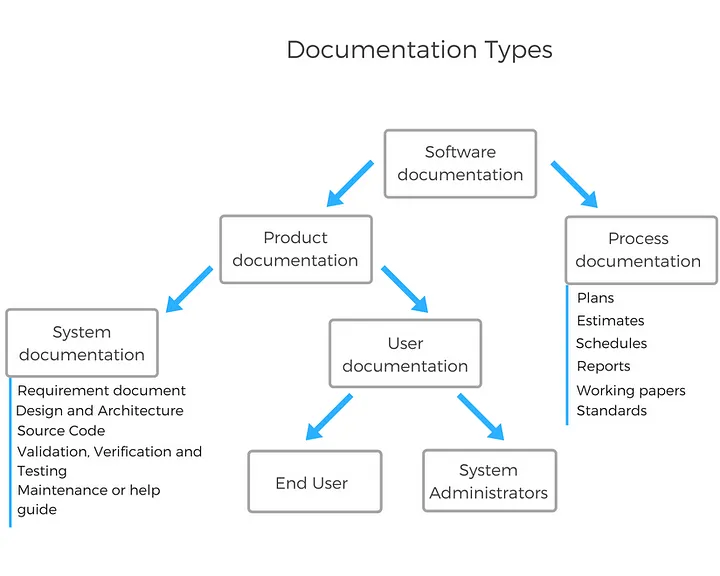

## Project Scope
The scope of this documentation project includes:
- Indexing and auditing the status of all existing documentation
- Bringing the documentation into a standardized and editable format and following the DPG standard opensource best practices
- Removing old and irrelevant documentation
- Updating and standardizing all project-critical documentation

## Activities

- [ ] Recruit and Appoint Documentation Project Lead and Project Manager 
  - Appointment of a Project Lead and Project Manager  
- [ ] [Complete inventory of existing documentation](#indexing-existing-documentation) 
  - MD file on Github with links and descriptions of all documentation
- [ ] [Perform an audit of Greenstand’s existing information](#auditing-existing-information) and documentation. Include what exists now, where it's located, updates needed, and any gaps, and enhancement opportunities. 
  - Adding document status to the MD file on Github with links and descriptions of all documentation.
- [ ] [Research options and best practices for Documentation structure](#standardizing-the-documentation)
  - Create a publicly accessible and linked road map file outlining path forward for documentation.
- [ ] [Identify and articulate needs/wants/desires for each of Greenstand’s three core audiences.](#greenstand-core-audiences)
  - MD file on Github containing research findings, outlining the current project state and suggestions for how to move forward
- [ ] Identify problem areas and outline the current process for onboarding core audiences.
  - MD file on Github with links to relevant onboarding files, recommended enhancements, additions/deletions, and processes for making updates ongoing
- [ ] Create a roadmap, and identify tasks, milestones, risks, the full scope, and key players required for the implementation of the documentation project. 
  - Publicly viable road map with open tickets and tickets assigned to individual contributors. 
- [ ] Project Management "project board set up
  - Using the audit findings to create tickets, log dependencies, and assign tasks.
- [ ] Identify opportunities to drive audience engagement with interactive or multi-media formats
  - Md file on Github with recommendations for videos or advanced Slack programming. Note: The creation of videos may occur as a second phase of the initiative. 
- [ ] Detailed review, rewriting, and revisions of documentation to enable volunteers of all skill levels to advance their skills here.
  - Advanced well-written documentation for all stakeholders with a focus on easy-to-find-and-follow pathways for volunteer contributors of all levels. 
- [ ] [Create a centralized documentation portal. Consolidation, indexing, and advancement of all critical documentation issues discovered in the audit.](#consolidating-documentation) 
  - A single well organized portal at `docs.greenstand.org`
- [ ] [Document and communicate a process for accessing, and maintaining/updating documents in the portal. Create supporting documentation. Develop oversight requirements and a process for updating/maintaining the portal.](#support-documentation)
  - Clear documentation.
- [ ] Communicate as necessary to raise awareness of the new portal and explain the process for document migration. 
  - Migrated documents.
- [ ] [Consolidate/migrate documentation, including archiving documentation and repositories that are old, outdated, or obsolete.](#archiving-old-documentation)
  - Clear and accurate documentation.

## Indexing existing documentation
- See [Documentation Inventory](documentationInventory.md)

## Auditing existing information
The documentation is outdated, ambiguous, partial, and scattered. It exists in sources such as:
- In various Gitbook spaces, many of which are inaccesible as:
  - their published spaces are not linked anywhere
  - their published spaces are not indexed by google
  - the Greenstand Gitbook is locked behind authorization
- In repos and wikis as given in the [Documentation Inventory](documentationInventory.md)

## Standardizing the documentation

Using the above image as a guideline, we can divide the documentation into 2 types (for now):
1. User Documentation (End users)
2. Technical/System Documentation (Contributors)
   - We ignore the third party integrations for later

  
- **User documentation**
  - Support Portals
  - FAQs
  - Video tutorials
  - Step-by-step guides
  - Embedded assistance
  - Software requirements.
  - Installation guide.
  - How to start the system.
  - How to use features of a product.
  - Screenshots explaining those features.
  - Contacts of the developer if an undocumented question arises and more.
  > Source: https://medium.com/@kesiparker/technical-documentation-vs-user-documentation-ff68e7de1985
- **Technical documentation**
  - How the review process works 
  - Style guides 
  - Schedules 
  - Design and Implementation
  - Release process checklists
  - Tools to use for development
  - How to use the build process 
  - Coding practices to follow 
  - Process to release a build to QA for testing  
  - Deploy or release a product
  - May use jargon or industry-specific terms

### New framework
- Single Documentation Portal
  - All the documentation is consolidated under `docs.greenstand.org`, via Gitbook
  - All documentation is up to date
- Keeping a changelog
- All relevant project repos have a `docs/` directory corresponding to a Gitbook space.
- Sustainable processes for maintaining documentation.

## Greenstand Core Audiences

## Consolidating documentation

## Support documentation

## Archiving old documentation

## TODOs
- Standardize documentation for project repos
  - README.md 
    - Summary
    - Installation steps
    - Contributing guidelines
    - Link to Github space
  - Gitbook space
  - No wikis