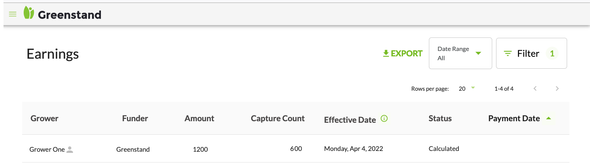

# Greenstand Documentation, Index

## Project Design

[Introduction to the purpose and design of Greenstand](project-design/)

## User Guides

[How to use Greenstand software tools](user-guides/)

## Contributor Docs

[Technical documentation for software developers](contributor-docs/)


```
// Some code
const sayHello = () => {
    console.log('Hello world');
};
```

<figure><figcaption><p>Happy Russian man</p></figcaption></figure>

<figure><figcaption><p><mark style="color:green;"><strong>Test image</strong></mark> </p></figcaption></figure>



Test video



